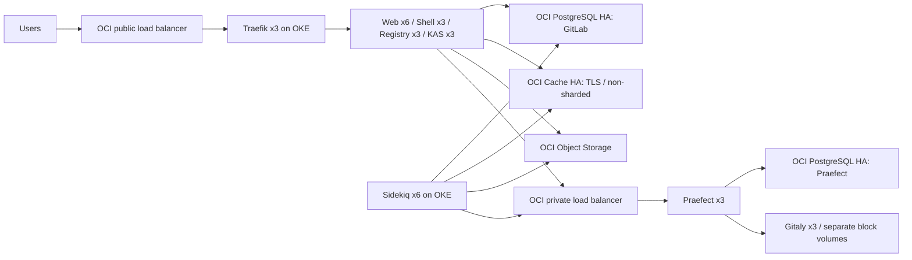

# Deploy GitLab on OCI

Provision OCI with Terraform, deploy GitLab with Ansible, then run benchmarks through Ansible and collect PNG/SVG reports. GitLab Runner registration is optional. All commands run from the repository root unless stated otherwise.

This guide starts with a fresh checkout and an existing OCI tenancy, compartment and API signing identity. It uses Dev mode with a public bastion for administrative access. DNS is optional: `domain = ""` serves GitLab at a public IP allocated during deployment. Addresses and cluster identifiers are read from Terraform outputs; no existing installation is required.

Dev and Prod use the same HA application sizing. Review the [architecture and capacity](#architecture-and-capacity) before provisioning.

## Workflow

1. [Prepare credentials and inputs](#1-prepare-the-controller).
2. [Provision infrastructure](#2-provision-oci-with-terraform).
3. [Open private access](#3-reach-private-hosts-and-oke-through-the-dev-bastion).
4. [Deploy GitLab](#4-deploy-gitlab-with-ansible).
5. Optionally [register a runner](#5-optionally-connect-gitlab-runner).
6. [Run benchmarks and collect reports](#6-run-benchmarks-and-generate-pngsvg-charts).
7. [Close the session](#7-finish-the-session) or [destroy and clean up](#8-destroy-the-deployment-and-clean-up).

## 1. Prepare the controller

Install Terraform >= 1.9 and < 2.0, Helm 3, Python 3.12 or newer, and OpenSSH on the machine running these commands. `kubectl` is optional for manual inspection. Python dependencies below include Ansible and the OCI CLI.

```sh
# Start in the root of your checkout.
python3 -m venv .venv
. .venv/bin/activate
python -m pip install -r terraform/ansible/requirements.txt
ansible-galaxy collection install -r terraform/ansible/requirements.yml

# Keep the remaining commands in this activated shell.
export ANSIBLE_CONFIG="$PWD/terraform/ansible/ansible.cfg"
export OCI_CLI_CONFIG_FILE="$PWD/identity/oci/config"
export OCI_CLI_PROFILE=DEFAULT
export SUPPRESS_LABEL_WARNING=True

# Disposable caches for this deployment session; remove them in step 7.
run_tmp=$(mktemp -d "${TMPDIR:-/tmp}/oci-gitlab-run.XXXXXX")
export TF_DATA_DIR="$run_tmp/terraform"
export ANSIBLE_LOCAL_TEMP="$run_tmp/ansible-local"
export MPLCONFIGDIR="$run_tmp/matplotlib"
export XDG_CACHE_HOME="$run_tmp/cache"
export HELM_CACHE_HOME="$run_tmp/helm-cache"
export HELM_CONFIG_HOME="$run_tmp/helm-config"
export HELM_DATA_HOME="$run_tmp/helm-data"
```

The `.venv` and installed Ansible collections are reusable controller dependencies. The session cache directory is disposable.

Create the local identity directories and input files. In the following commands, replace `/path/to/registered-api-key.pem` with your existing OCI API signing private key. Its public key must already be registered for your OCI user. The SSH key is a separate key used to access the VMs.

```sh
mkdir -p identity/oci identity/ssh
chmod 700 identity identity/oci identity/ssh
cp identity/oci/config.example identity/oci/config
cp /path/to/registered-api-key.pem identity/oci/api_key.pem
chmod 600 identity/oci/config identity/oci/api_key.pem

# Generate a new VM access key, or copy your existing pair to these paths.
ssh-keygen -t ed25519 -f identity/ssh/id_ed25519 -C "gitlab-oci"
# If you set a passphrase, load the key into your SSH agent before Ansible.
# ssh-add identity/ssh/id_ed25519

cp terraform/terraform.tfvars.example terraform/dev.tfvars
```

Edit `identity/oci/config` and `terraform/dev.tfvars` before running Terraform. These files are local configuration and are ignored by Git. The example Terraform inputs use the identity paths created above; the OCI CLI profile's `key_file` must be the **absolute path** to `identity/oci/api_key.pem` in your checkout. Configure the same user, tenancy and fingerprint in both files. Use the `DEFAULT` profile for these commands, or update `OCI_CLI_PROFILE` and `oci_profile` together.

Fill in the following inputs:

| Input | What to supply |
| --- | --- |
| `tenancy_ocid`, `compartment_ocid`, `user_ocid`, `fingerprint` | Your OCI identity and destination compartment |
| `region`, `tenancy_home_region` | Deployment region and the tenancy's home region; also set the CLI profile region |
| `kubernetes_version`, `oke_image_ocid` | A supported OKE version and regional Oracle Linux x86_64 OKE image matching its exact patch version; replace the illustrative version in the example |
| `ubuntu_image_ocid` | A regional Ubuntu 24.04 x86_64 platform image |
| `object_storage_user_ocid` | An existing IAM user for the S3 Customer Secret Key |
| `bastion_ssh_cidrs` | Uncomment and set to the public source CIDR(s) of your controller; the empty default blocks inbound SSH |
| `runner_count` | Add `runner_count = 3` if following the runner and load-test steps; its default is zero |
| `domain`, `dns_zone_ocid` | Optional DNS name and existing public OCI DNS zone; leave `domain = ""` for IP access |

Keep `mode = "Dev"` for this bastion-based walkthrough. Choose a distinct `name` for your installation. Leave `admin_cidrs = []` when using only the bastion; it is for other privately routed controller networks. For DNS access without `dns_zone_ocid`, create the records yourself after Terraform supplies the public IP.

If you keep credentials outside the checkout, set `oci_private_key_file`, `oci_config_file`, `ssh_public_key_file` and `ssh_private_key_file` to their absolute paths in `dev.tfvars`, and update `OCI_CLI_CONFIG_FILE` here to match. Never overwrite an existing key or input file when repeating setup for an established deployment.

The deploying OCI identity needs permissions for networking, OKE, compute, volumes/backups, PostgreSQL/configurations, cache/configurations, buckets and compartment IAM policies, plus DNS if enabled. Tenancy IAM permissions are required to create the Object Storage group, add the selected user, and create its Customer Secret Key. That user must have an available Customer Secret Key slot. The Ansible identity also needs Kubernetes administrator access to OKE.

Use a region with three availability domains and the required managed services. `require_three_ads = true` enforces this. The default VCN is `10.60.0.0/16`; pods use `10.244.0.0/16` and services use `10.96.0.0/16`. Avoid overlap with connected networks. The controller and nodes require outbound access to OCI APIs and package, image and Helm registries.

## 2. Provision OCI with Terraform

```sh
terraform -chdir=terraform init
terraform fmt -check terraform/main.tf
terraform -chdir=terraform validate
terraform -chdir=terraform plan -var-file=dev.tfvars -out=deployment.tfplan

# Review the plan above, then apply that exact saved plan.
terraform -chdir=terraform apply deployment.tfplan
terraform -chdir=terraform output
```

Always name `dev.tfvars` explicitly when planning; Terraform does not automatically load that filename. The saved plan is at `terraform/deployment.tfplan` and already contains the selected inputs. Apply does not take another `-var-file` argument. After a successful apply, remove that applied plan; retain plans still awaiting review or use.

Terraform creates the VCN, private OKE cluster/node pools, public bastion, repository VMs, managed PostgreSQL/Redis, buckets and load balancers. It writes `identity/dev/inventory.yml`, including generated credentials. Ansible performs the software deployment. Preserve the state after the first apply and reuse it for subsequent updates; a fresh state does not adopt existing resources.

For independent Prod, use a separate checkout and Terraform state with distinct names and VCNs. Populate the base input file in that checkout as above, then copy `terraform/prod.tfvars.example` to `terraform/prod.tfvars` and edit the overrides. That example is an overlay, not a complete variable file:

```sh
# In the separate Prod checkout, after filling in both files:
terraform -chdir=terraform plan -var-file=dev.tfvars -var-file=prod.tfvars -out=deployment.tfplan
```

Use `identity/prod/` and its generated inventory for Prod. Changing `mode` in an existing Dev state does not create an independent environment. The public bastion in this runbook is created in Dev; Prod requires private controller connectivity or a separately provided bastion.

## 3. Reach private hosts and OKE through the Dev bastion

This path requires no VPN or routing controller. SSH ProxyJump reaches backend VMs, and a local SSH port forward reaches the private Kubernetes API. Run these commands after Terraform apply, in the same shell as step 1.

```sh
export DEPLOY_IDENTITY="$PWD/identity/dev"
mkdir -p "$DEPLOY_IDENTITY"
chmod 700 "$DEPLOY_IDENTITY"

# Build SSH settings from the generated inventory without printing credentials.
python - <<'PY_SSH'
import os, subprocess
from pathlib import Path
import yaml
root = Path(os.environ['DEPLOY_IDENTITY'])
variables = yaml.safe_load((root / 'inventory.yml').read_text())['all']['vars']
bastion = subprocess.check_output(
    ['terraform', '-chdir=terraform', 'output', '-raw', 'bastion_public_ip'], text=True
).strip()
settings = (
    f'Host gitlab-bastion\n  HostName {bastion}\n'
    f'Host *\n  User ubuntu\n'
    f'  IdentityFile "{variables["ansible_ssh_private_key_file"]}"\n'
    f'  IdentitiesOnly yes\n'
    f'  UserKnownHostsFile "{root / "known_hosts"}"\n'
    f'  StrictHostKeyChecking accept-new\n'
)
(root / 'ssh_config').write_text(settings)
(root / 'ssh_config').chmod(0o600)
PY_SSH

export ANSIBLE_SSH_ARGS="-F $DEPLOY_IDENTITY/ssh_config -o ControlMaster=auto -o ControlPersist=60s"
export ANSIBLE_SSH_COMMON_ARGS="-o ProxyJump=gitlab-bastion"

oci_region=$(python - <<'PY_REGION'
import os
from pathlib import Path
import yaml
inventory = Path(os.environ['DEPLOY_IDENTITY']) / 'inventory.yml'
print(yaml.safe_load(inventory.read_text())['all']['vars']['oci_region'])
PY_REGION
)
oci ce cluster create-kubeconfig \
  --cluster-id "$(terraform -chdir=terraform output -raw cluster_id)" \
  --file "$DEPLOY_IDENTITY/kubeconfig" \
  --region "$oci_region" --profile "$OCI_CLI_PROFILE" \
  --token-version 2.0.0 --kube-endpoint PRIVATE_ENDPOINT
chmod 600 "$DEPLOY_IDENTITY/kubeconfig"

# Preserve the original kubeconfig; make a separate copy for the local tunnel.
python - <<'PY_KUBE'
import os
from pathlib import Path
from urllib.parse import urlsplit
import yaml
root = Path(os.environ['DEPLOY_IDENTITY'])
config = yaml.safe_load((root / 'kubeconfig').read_text())
context = next(c['context'] for c in config['contexts'] if c['name'] == config['current-context'])
cluster = next(c['cluster'] for c in config['clusters'] if c['name'] == context['cluster'])
endpoint = urlsplit(cluster['server'])
(root / 'oke-api-host').write_text(endpoint.hostname + '\n')
cluster['tls-server-name'] = cluster.get('tls-server-name', endpoint.hostname)
cluster['server'] = 'https://127.0.0.1:16443'
(root / 'kubeconfig-tunnel').write_text(yaml.safe_dump(config))
(root / 'kubeconfig-tunnel').chmod(0o600)
PY_KUBE

ssh -F "$DEPLOY_IDENTITY/ssh_config" \
  -o ExitOnForwardFailure=yes -o ControlMaster=yes \
  -o ServerAliveInterval=30 -o ServerAliveCountMax=6 \
  -o ControlPath="$DEPLOY_IDENTITY/bastion-control" \
  -fNT -L "127.0.0.1:16443:$(cat "$DEPLOY_IDENTITY/oke-api-host"):6443" \
  gitlab-bastion
export KUBECONFIG="$DEPLOY_IDENTITY/kubeconfig-tunnel"

ansible -i "$DEPLOY_IDENTITY/inventory.yml" 'gitaly:praefect' -m ping
```

The SSH settings save new host keys and reject changed keys. Kubernetes still verifies the original API server identity using its CA and `tls-server-name`; TLS verification is not disabled. Keep the tunnel open through the Ansible steps. If port 16443 is already occupied by a previous run, close that tunnel using step 7 before starting another.

With existing private routing, use `identity/dev/kubeconfig` directly and omit the SSH tunnel and ProxyJump settings. For manual Helm or kubectl commands, keep `OCI_CLI_CONFIG_FILE`, `OCI_CLI_PROFILE` and `KUBECONFIG` exported.

## 4. Deploy GitLab with Ansible

Public TLS files belong at `identity/fullchain.pem` and `identity/privkey.pem`. A complete existing pair is validated for matching keys, expiry and endpoint SANs. If either file is missing, Ansible generates a self-signed certificate after Terraform allocates the public IP, preserving an existing private key and backing up an orphaned certificate. Trust the generated certificate in browsers, Git and Registry clients. Existing complete pairs are reused; renew them before expiry.

For DNS access, finish the `gitlab.<domain>`, `registry.<domain>` and `kas.<domain>` A records before running this playbook. Certificates must cover all three names, or the public IP SAN for IP access.

```sh
ansible-playbook -i "$DEPLOY_IDENTITY/inventory.yml" \
  terraform/ansible/site.yml \
  -e "kubeconfig_path=$KUBECONFIG"
```

Optional overrides such as `backup_scratch_size` can go in `terraform/ansible/site.local.yml`, copied from [site.local.yml.example](terraform/ansible/site.local.yml.example). Add `-e @terraform/ansible/site.local.yml` to the command when using that file.

The playbook prepares persistent internal PKI, mounts repository volumes, creates database roles/extensions, configures Gitaly and Praefect, deploys Traefik and GitLab with Helm, runs chart database migrations, enables shared job logs, verifies public readiness and repository connectivity, and saves a Kubernetes secrets recovery snapshot. The private kubeconfig you generated is reused. Allow the first installation and database migrations time to finish.

```sh
gitlab_url=$(terraform -chdir=terraform output -raw gitlab_url)
curl --cacert identity/fullchain.pem "$gitlab_url/-/readiness"
```

Open `gitlab_url` and sign in as **root**. Retrieve the initially generated password locally without dumping the whole inventory:

```sh
python - <<'PY_PASSWORD'
import os
from pathlib import Path
import yaml
inventory = Path(os.environ['DEPLOY_IDENTITY']) / 'inventory.yml'
print(yaml.safe_load(inventory.read_text())['all']['vars']['secrets']['root'])
PY_PASSWORD
```

This is the initial password; it does not track later password changes in GitLab. Do not run this retrieval command in CI logs.

| Access mode | GitLab | Registry | KAS | Git SSH |
| --- | --- | --- | --- | --- |
| Public IP | `https://<public_ip>` | `https://<public_ip>:5050` | `wss://<public_ip>:8150` | `<public_ip>:22` |
| DNS | `https://gitlab.<domain>` | `https://registry.<domain>` | `wss://kas.<domain>` | `gitlab.<domain>:22` |

The Git SSH endpoint is on the GitLab load balancer IP. Administrative SSH uses the separate bastion IP.

## 5. Optionally connect GitLab Runner

The Ansible benchmark creates an OKE Job directly and does **not** require a registered GitLab Runner or `.gitlab-ci.yml`. Both benchmark Jobs and optional runner jobs use the pool controlled by `runner_count`; set it to 3 for three dedicated 4 OCPU / 16 GiB nodes. A value of zero disables that pool and cannot run this benchmark workflow.

Run this optional step only if you also want GitLab CI runners for your own projects:

```sh
ansible-playbook -i "$DEPLOY_IDENTITY/inventory.yml" \
  terraform/ansible/runners.yml \
  -e "kubeconfig_path=$KUBECONFIG"
```

This registers an instance runner tagged `loadtest`, installs its manager in `gitlab-loadtest`, and verifies authentication. Manager and job pods select the dedicated runner pool. The runner handles up to three concurrent jobs, accepts tagged jobs only, and trusts the deployment certificate. Its temporary bootstrap API token is revoked after registration. The persistent authentication token is saved in `identity/dev/runner-token`; reruns reuse it. Preserve that file while the deployment exists.

## 6. Run benchmarks and generate PNG/SVG charts

Keep the OKE tunnel and controller environment active. After GitLab is ready, run the expanded suite:

```sh
ansible-playbook -i "$DEPLOY_IDENTITY/inventory.yml" \
  terraform/ansible/loadtest.yml \
  -e "kubeconfig_path=$KUBECONFIG" \
  -e benchmark_full_suite=true

# For the default safe subset, omit benchmark_full_suite=true.
# For one safe diagnostic test, omit full-suite mode and add:
# -e benchmark_tests=api_v4_projects.js
```

This uses the official [GitLab Performance Tool](https://gitlab.com/gitlab-org/quality/performance), pinned to 2.17.0, following GitLab's [benchmarking workflow](https://handbook.gitlab.com/handbook/support/workflows/gpt_quick_start/). It generates the upstream **2k data profile** in the dedicated `gpt-benchmark` group: 1,000 subgroups, 10 projects per subgroup, and the large `gitlabhq` project on the `default` repository storage. Data is retained and reused on later runs. Reserve that group for GitLab Performance Tool; its generator may rebuild outdated test data. Allow several hours for first-time generation and the full suite, plus disk space for imports and repositories.

The default `60s_40rps.json` profile runs each supported safe API, web and Git test separately, using upstream rates and thresholds (40 API RPS, with upstream reductions for web/Git). GitLab Performance Tool excludes unsafe, quarantined, experimental and unsupported tests by default. This is a 2k reference workload, not proof of a 2,000-user capacity rating. Run against an isolated test instance; avoid overlapping benchmarks and unrelated CI load.

The command above enables the expanded suite with `benchmark_full_suite=true`. This inventories all 97 tests in the pinned GitLab Performance Tool release, enables write scenarios, Git push and quarantined/experimental tests, and runs every selected test at the same upstream rates and thresholds. Write scenarios create and delete their own fixture groups under the reserved GitLab Performance Tool group; preparation rejects name collisions outside that group. Known upstream issues in quarantined tests may cause failures.

The expanded run writes `suite-coverage.json` and includes coverage in the chart summary: passed, failed, blocked by prerequisites, and missing results. On an unlicensed deployment, 80 tests are selected and 17 are blocked: six advanced-search tests, four vulnerability-report tests, and seven AI tests. Search requires a paid license and an indexed search service; vulnerability tests require Ultimate and generated security fixtures; AI tests require the corresponding Duo activation, entitlement and configuration. The current wrapper records vulnerability tests as blocked because it does not provision those fixtures. Provisioning these prerequisites is necessary before claiming all 97 tests were executed. Full mode overrides `benchmark_tests` so a filename override cannot silently narrow coverage.

The wrapper applies data-generator compatibility fixes: incomplete subgroups are filled in place, and unexpected extra groups or projects cause a failure instead of automatic deletion. The upstream benchmark tests are unchanged. Preparation temporarily disables the relevant group/project API limits and uses four generator threads with up to three resumable attempts for transient failures; it does not change the benchmark rates. Override `benchmark_generator_pool_size` in Ansible if needed.

The Job requests three CPUs and 8 GiB memory on the runner pool, with an eight-hour deadline. Monitor generator resource usage when interpreting results.

The playbook creates a temporary administrator API token with a two-day expiry (to cover runs crossing UTC midnight), captures recovery settings, runs generation and testing, collects results and revokes the token. GitLab Performance Tool temporarily adjusts imports, storage selection and selected rate limits; the playbook restores the saved settings even when tests fail. Do not terminate the controller mid-run. If interrupted, preserve the run directory and recover the settings before running again. Upstream GitLab Performance Tool disables TLS verification for benchmark requests; controller API calls still verify the deployment certificate.

Results are saved under `identity/dev/benchmark/benchmark-<timestamp>/`:

- `generator.log`, `benchmark.log`, `environment.json` and `run-manifest.json` describe the workload and execution.
- Upstream JSON, CSV and text reports preserve the original scores, thresholds and individual k6 results.
- `charts/summary.md` provides a readable results table; `charts/summary.json` provides test counts and failures for automation. Paginated PNG/SVG charts show each endpoint's P90 time to first byte, achieved RPS and successful-request percentage against its upstream thresholds. Percentiles from different endpoints are never combined.
- `generator-resources.jsonl` records cgroup CPU/memory counters when available; `charts/generator-resources.png` and `.svg` show benchmark-phase usage against container limits. Samples can miss brief peaks.
- `application-settings-before.json` is a private recovery snapshot; preserve it with the private run results.

The playbook fails after collecting results if GitLab Performance Tool reports failures or no aggregate report was produced. Missing metrics appear as N/A. A failed data generation is not a performance result.

## 7. Finish the session

After the final checks, close the tunnel and remove only the cache directory created in step 1:

```sh
ssh -F "$DEPLOY_IDENTITY/ssh_config" \
  -S "$DEPLOY_IDENTITY/bastion-control" -O exit gitlab-bastion

# Inspect the exact task directory before deleting it.
ls -ld "$run_tmp"
case "$run_tmp" in
  */oci-gitlab-run.*) rm -rf -- "$run_tmp" ;;
  *) echo "Unexpected cache path; inspect it before removing anything." ;;
esac
unset TF_DATA_DIR ANSIBLE_LOCAL_TEMP HELM_CACHE_HOME HELM_CONFIG_HOME HELM_DATA_HOME
unset ANSIBLE_SSH_ARGS ANSIBLE_SSH_COMMON_ARGS KUBECONFIG MPLCONFIGDIR XDG_CACHE_HOME
```

While infrastructure exists, preserve Terraform state/backups, `.terraform.lock.hcl`, variable files, deployment plans awaiting use, the reusable `.venv`, and every persistent identity/recovery file. On a later session, activate `.venv`, reestablish the step 1 environment, run Terraform init if needed, and reopen the step 3 tunnel before using Ansible.

## 8. Destroy the deployment and clean up

Use the same checkout, state and variable file that created the environment. Reestablish the controller environment, Terraform initialization and OKE tunnel if needed. Destruction deletes application data; retain any backups you intend to restore before starting.

### Remove deployment dependencies

Before destroying the bastion or OKE cluster:

1. Stop benchmark Jobs and application writers, including scheduled backup jobs.
2. Delete the deployment's Kubernetes LoadBalancer services and wait for OCI to remove their load balancers. Remove deployment PVCs only after deciding whether their data must be retained; inspect the resulting volumes and reclaim policies.
3. Empty the deployment's Object Storage buckets, including **all versions**, delete markers and multipart uploads. Terraform cannot delete a nonempty bucket. Identify buckets from this deployment's state rather than deleting by a broad compartment filter.
4. Close the SSH tunnel using step 7, but retain the session cache and inventory until teardown finishes.

### Run Terraform destroy

Four resources deliberately use `prevent_destroy`. Create a temporary override for this authorized teardown; leave the original safeguards in `main.tf`:

```sh
cat > terraform/destroy_override.tf <<'HCL'
resource "oci_core_volume" "gitaly" {
  lifecycle { prevent_destroy = false }
}
resource "oci_psql_db_system" "this" {
  lifecycle { prevent_destroy = false }
}
resource "oci_redis_redis_cluster" "this" {
  lifecycle { prevent_destroy = false }
}
resource "oci_objectstorage_bucket" "this" {
  lifecycle { prevent_destroy = false }
}
HCL

terraform -chdir=terraform plan -destroy -var-file=dev.tfvars -out=destroy.tfplan
# Inspect the resources to be deleted, then apply the reviewed plan.
terraform -chdir=terraform apply destroy.tfplan
terraform -chdir=terraform state list
```

The final state listing should be empty. Also inspect OCI for deployment-owned instances, boot/block volumes, load balancers, buckets, backups and network resources. Decide explicitly which backups to retain. OCI Cache can leave a `redis-security-list` in the deployment VCN; if it blocks deletion, verify its VCN and attachments, remove it, and plan the remaining destroy again. Node pools can spend up to an hour draining; monitor OCI work requests before intervening.

If destruction fails, preserve state, inventory and recovery material, resolve the reported dependency and generate a fresh destroy plan. Do not delete state to conceal resources that still exist.

### Remove obsolete local artifacts

After confirmed teardown, inspect and remove these exact paths for the destroyed environment:

| Remove | Preserve |
| --- | --- |
| `identity/dev/ansible/`, generated internal `pki/`, `inventory.yml`, kubeconfigs, generated SSH/tunnel files, `runner-token`, `kubernetes-secrets-recovery.yml` | `identity/dev/benchmark/` and every retained result, log and chart |
| Temporary `destroy-recovery-*` snapshots created for this teardown | Independent user backups and reusable OCI/SSH credentials |
| Applied plans, `terraform/destroy_override.tf`, `.terraform/`, session caches, downloaded validation tools and logs | `.terraform.lock.hcl`, Terraform/Ansible source, variable files and examples |
| Obsolete deployment files under legacy `terraform/generated/`, if present | User-supplied/public TLS certificate and key files |

Remove the temporary override even if you abandon a failed teardown, so later operations retain the normal safeguards. Keep recovery material until the remaining infrastructure is accounted for.

By default, preserve the empty state and its normal backup. For an intentional complete local reset, verify teardown first and then explicitly remove `terraform/terraform.tfstate` and `terraform/terraform.tfstate.backup`. Never delete another environment's state. The next deployment starts with `terraform init` and creates a new inventory.

Finish the cache cleanup in step 7 and verify that the identified temporary paths are gone. For the standard Dev layout, only `identity/dev/benchmark/` should remain, unless it also contains user-owned files. State, caches and generated/private files are ignored by Git; ignoring them does not remove them.

A fresh deployment may receive a different public IP. A retained public TLS pair must cover the new endpoint; supply a matching pair or deliberately renew the generated certificate before running Ansible again.

## Identity and recovery files

Step 1 creates the local credential directories using [identity/oci/config.example](identity/oci/config.example). Terraform creates the environment inventory; the access setup and Ansible generate the remaining files as needed. The tree below shows the resulting layout, not files that must already exist in a fresh checkout. Credential paths can be overridden as described in step 1.

```text
identity/
  oci/config.example             # Tracked example; no private credentials
  oci/config                     # Optional local OCI profile
  oci/api_key.pem                 # Optional local API signing key
  ssh/id_ed25519{,.pub}           # Optional local SSH key pair
  fullchain.pem                  # Public TLS certificate
  privkey.pem                    # Public endpoint's TLS private key
  dev/                           # Or prod/ for a separate deployment
    inventory.yml                # Terraform-generated inventory and credentials
    kubeconfig                   # Original private OKE endpoint
    kubeconfig-tunnel             # Local tunnel copy
    ssh_config, known_hosts       # Bastion access and saved host identities
    oke-api-host                  # Private API host used by the tunnel
    runner-token                 # Persistent runner authentication token
    pki/                         # Internal CA and backend certificates/keys
    ansible/                     # Rendered Helm values and configuration
    kubernetes-secrets-recovery.yml
    benchmark/                   # GitLab Performance Tool native reports, recovery settings, PNG/SVG charts
```

`identity/` is ignored by Git except for `oci/config.example`. Keep environment directories mode `0700` and private keys/secrets mode `0600`, with encrypted off-host backups. Preserve these files while the deployment exists; use step 8 to remove generated files after destruction. Public self-signed certificates last 365 days; internal CA and backend certificate lifetimes are ten years and 825 days respectively. Renewal requires deliberate handling because existing keys and complete certificates are preserved.

## Architecture and capacity

The linked [2k architecture](https://docs.gitlab.com/administration/reference_architectures/2k_users/#cloud-native-hybrid-reference-architecture-with-helm-charts-alternative) explicitly does not provide HA. This implementation adds the repository replication and service redundancy described by the [3k HA architecture](https://docs.gitlab.com/administration/reference_architectures/3k_users/). This is an implementation adapted for OCI, not a claim of GitLab performance certification for OCI.

| Component | Deployment | Availability |
| --- | --- | --- |
| Kubernetes | OKE enhanced cluster; private API | Managed control plane |
| Web | 3 OKE nodes, each 8 OCPU / 48 GiB; 6 pods, each 4 Puma workers and 12 GiB Rails memory | Pods spread across nodes; surviving 2 nodes have room for all 6 pods |
| Sidekiq | 3 OKE nodes, each 2 OCPU / 16 GiB; 6 pods | Surviving 2 nodes have room for all 6 pods |
| Supporting services | 3 OKE nodes, each 2 OCPU / 16 GiB | 3 ingress, Shell, KAS and Registry replicas; disruption budgets |
| Repositories | 3 Gitaly VMs, each 4 OCPU / 32 GiB and 1 TiB block volume | One replica per AD; replication factor 3 |
| Repository routing | 3 Praefect VMs, each 1 OCPU / 4 GiB | Private OCI flexible load balancer with health checks |
| GitLab PostgreSQL | OCI Database with PostgreSQL 17, 3 nodes, each 2 OCPU / 32 GiB | Primary endpoint, managed failover, regional storage |
| Praefect PostgreSQL | A separate OCI PostgreSQL system with the same HA configuration | Dedicated database system, as required by GitLab |
| Redis | OCI Cache Redis 7, 3 nodes, 8 GiB each | Non-sharded primary/replicas, TLS, `noeviction` |
| Objects | 11 private, versioned OCI Object Storage buckets | S3 compatibility API; separate buckets for each data class |
| Public ingress | OCI flexible load balancer, reserved IP | TCP 443/80/22, plus 5050/8150 for IP access; HTTPS terminates in HA Traefik |
| Monitoring | 2 Prometheus replicas, backend exporters, and the managed OKE metrics-server add-on | Independent scrapers; ephemeral two-day history; certificate-manager supplies the metrics add-on dependency |
| Load generation | Optional dedicated OKE nodes, each 4 OCPU / 16 GiB; count set by `runner_count` | GitLab Runner job pods and Ansible k6 jobs select only this pool |

On the default x86 shapes, one OCPU is two vCPUs. This is intentionally larger than a single-node 2k installation. The application uses 15 compute/OKE nodes plus 6 managed PostgreSQL instances and 3 cache nodes. Dev additionally provisions one public bastion VM and, with `runner_count = 3`, three dedicated OKE runner nodes. Review quotas and the Terraform plan before applying.

### Benchmark findings behind the web sizing

The retained `benchmark-20261001110850` run used GitLab 19.4.0, GitLab Performance Tool 2.17.0 and `60s_40rps`: **79 passed, one failed, 17 blocked** out of 97 inventoried tests. All four former Rails pods were OOMKilled at 7 GiB during `web_user`; its retry reached only 64.79% successful requests. Project listing passed but reached 4,505 ms P90 TTFB at 16.08 RPS. The saved data does not establish database or storage saturation.

The updated configuration uses six Rails pods with 12 GiB requested and limited memory, four Puma workers each, and a 1,500 MB worker memory watchdog. The [watchdog](https://docs.gitlab.com/charts/charts/gitlab/webservice/#memory) acts periodically, so memory headroom remains necessary. Three 8 OCPU / 48 GiB web nodes allow three pods per surviving node after one failure: 12.3 requested vCPUs, 36 GiB Rails memory and up to 1.5 GiB Workhorse memory per node. Verify actual allocatable capacity. Rolling updates use zero surge and one unavailable pod; CPU limits remain unset.

These changes add 6 OCPUs and 48 GiB across the web pool and **have not been benchmarked after redeployment**. Rerun the expanded suite at unchanged rates and thresholds, including the quarantined `web_user` test. Require no new OOM terminations and >99% successful requests for that test. Collect application CPU/memory, worker restarts and backend timing data before attributing latency to a particular service. Generator samples alone do not measure GitLab resource use.

Keep `local.pools.web` in [main.tf](terraform/main.tf) and `web_*` settings in [Ansible defaults](terraform/ansible/group_vars/all.yml) consistent when resizing. Saved reports remain under the private benchmark directory; they are not required in a fresh checkout.




Pinned application versions are GitLab chart **10.4.0 / GitLab EE 19.4.0**, PostgreSQL **17**, Traefik chart **41.6.0**, and Runner chart **0.93.0**. See [main.tf](terraform/main.tf) and [Ansible version settings](terraform/ansible/group_vars/all.yml). The Terraform dependency lock file is preserved.

## Security and durability

The API, application nodes, PostgreSQL, cache and repository hosts are private. NSGs permit the defined service flows. Redis uses OCI's TLS endpoint with network isolation and its default no-password authentication; GitLab's Redis AUTH is explicitly disabled. PostgreSQL connections verify the server hostname against the OCI private CA. Gitaly and Praefect use authenticated TLS, with certificates covering their actual private IPs and the private load-balancer address. Public HTTP redirects to HTTPS.

OCI encrypts managed data at rest. Repository block-volume transport encryption is enabled. Buckets have no public access, and GitLab uses path-style S3 requests with streaming signatures disabled as required by [GitLab's OCI object-storage guidance](https://docs.gitlab.com/administration/object_storage/#oracle-cloud-infrastructure). Client downloads are proxied through GitLab/Registry. Registry uses the current `s3_v2` driver with upload checksums disabled for S3 compatibility, following the [GitLab 19 storage-driver guidance](https://docs.gitlab.com/update/versions/gitlab_19_changes/#container-registry-s3-storage-driver-replaced-by-s3_v2).

Terraform state, saved plans, generated inventory and Ansible state contain passwords, private keys or recovery secrets. They are ignored by Git but still exist on disk. Store state in an access-controlled, encrypted backend with appropriate locking before team use, restrict controller access, and keep encrypted off-host copies of `identity/`. The `terraform-state` application bucket stores **users' GitLab Terraform state**, not the deployment's own backend. No backend is silently selected or bootstrapped inside the deployment it protects.

Repository volumes, PostgreSQL systems, cache and buckets have `prevent_destroy`. Destruction or replacement requires a deliberate configuration change and a recovery plan. Do not remove those resource definitions to bypass the safeguards. Ansible never forces a filesystem overwrite, uses filesystem UUIDs in fstab, and prevents GitLab from starting without its repository mount.

## Backups and operations

- Both PostgreSQL systems get daily OCI backups with 30-day retention. Gitaly volumes use OCI's built-in gold backup policy. These independent snapshots are supplemental recovery inputs, not a transactionally coordinated GitLab backup.
- A daily GitLab Toolbox backup job writes application/repository backups to Object Storage. Each job gets a temporary `oci-bv` volume; `backup_scratch_size` defaults to 1 TiB and must cover backup working space for your actual data. The restore staging bucket is separate. Verify the OCI CSI storage class exists before relying on scheduled backups.
- Object buckets are versioned. GitLab backups do not replace protection of objects already stored in external buckets. Decide retention/lifecycle rules and cross-region copies for your recovery policy; none of the versioned objects are automatically expired here.
- Ansible saves the chart-generated Rails/SSH/Registry and other Kubernetes secrets to a mode-0600 recovery file after deployment. Move an encrypted copy off the controller. Restore those secrets along with application data; losing Rails encryption secrets can make protected database fields unusable.
- Restore into an isolated environment using the matching GitLab version, the saved secrets, database/application backup and object data. Follow the [GitLab chart restore procedure](https://docs.gitlab.com/charts/backup-restore/restore/) and [Praefect recovery guidance](https://docs.gitlab.com/administration/gitaly/praefect/recovery/). Validate repository mappings and replication before accepting writes. Exercise this procedure; no RPO/RTO is claimed without a restore test.
- Prometheus collects application and external Gitaly/Praefect/node metrics. Configure alert delivery and long-term remote-write storage for your operations environment. Its two replicas have independent ephemeral storage, so historical metrics do not survive both pods being replaced. Native PostgreSQL/cache/LB metrics are available through OCI Monitoring; external alert destinations are not provisioned.
- Monitor memory/no-eviction errors on Redis, database connection usage, repository disk capacity, replication lag, backup completion and TLS expiry. The public self-signed certificate lasts 365 days, the internal CA ten years and backend certificates 825 days. Plan certificate renewal before expiry; existing files are intentionally reused rather than automatically rotating trust on every run.
- Scale pools and pod counts together. Pod counts are held at fixed HPA min/max values for predictable initial capacity; node autoscaling is not enabled. Keep the OKE metrics-server available for HPA operation. Backend replacement and GitLab upgrades are separate operational events, not unattended auto-upgrades. Update chart/package pins together, obey required GitLab upgrade stops, and validate migrations/backups in staging. The first-play version assertion intentionally requires updating the checked version pair.

HA is within one OCI region. Managed failover and pod rescheduling can cause short interruptions; in-flight Git operations may need retries. Redis replication is asynchronous, so replica promotion does not guarantee zero lost queued jobs. Three ADs and three repository copies do not provide regional disaster recovery. SMTP, identity-provider integration, Pages and advanced search are not deployed. Ansible benchmark load generation runs on the dedicated OKE pool and must be included when assessing cluster capacity.

## Verification and troubleshooting

The runbook's Terraform validation/plan, Ansible connectivity checks, public readiness check, runner authentication check and k6 thresholds cover the deployment path. Offline Terraform tests and manifest/certificate checks live in [terraform/tests/](terraform/tests/). Run broader verification before production acceptance: web login, SSH/HTTPS clone and push, LFS, artifact/package transfer, registry push/pull, and isolated failover/restore exercises.

- **DNS or cross-node pod timeouts:** OKE Flannel in this deployment uses UDP **14789**, permitted between worker NSGs. The generic Flannel port 8472 does not match this OKE configuration.
- **Public TLS connection closes before a handshake:** check OCI load-balancer backend health. Its kube-proxy health check uses TCP **10256**; Terraform permits it from the public load-balancer NSG to workers, along with the NodePort range.
- **Private API unreachable:** confirm the bastion tunnel is open, port 16443 is free, and Ansible receives `-e "kubeconfig_path=$KUBECONFIG"`. Keep the CA and `tls-server-name` in the tunnel kubeconfig.
- **Repository commits time out:** Gitaly must reach the private Praefect load balancer on TCP 3305. Terraform includes this return path in addition to worker-to-Praefect traffic. A passing readiness check alone does not exercise repository writes.
- **Backend SSH fails:** check `bastion_ssh_cidrs`, SSH key paths and saved host keys. For backend administration use `ssh -F identity/dev/ssh_config -J gitlab-bastion ubuntu@<private_ip>`.
- **A plan wants to detach the ingress IP:** keep the `private_ip_id` lifecycle ignore rule on the reserved IP. Kubernetes manages its attachment to the public load balancer.
- **Initial password no longer works:** the inventory stores the bootstrap password, not later password changes.

Primary references: [GitLab requirements](https://docs.gitlab.com/install/requirements/), [Gitaly Cluster](https://docs.gitlab.com/administration/gitaly/praefect/configure/), [OKE networking](https://docs.oracle.com/en-us/iaas/Content/ContEng/Concepts/contengnetworkconfig.htm), and [OCI Terraform provider](https://docs.oracle.com/en-us/iaas/tools/terraform-provider-oci/latest/).


## OCI cost estimate

Upload [the estimator JSON](bom/oci-gitlab-cost-estimate.json) to the [OCI Cost Estimator](https://www.oracle.com/cloud/costestimator.html) to view pricing and adjust the configuration for your environment.

The estimate assumes a continuously deployed Ashburn Dev environment with three runner nodes and one benchmark suite per day. Review [the assumptions and coverage audit](bom/oci-gitlab-cost-assumptions.json) for storage, backups, traffic and usage projections before using it for planning.
